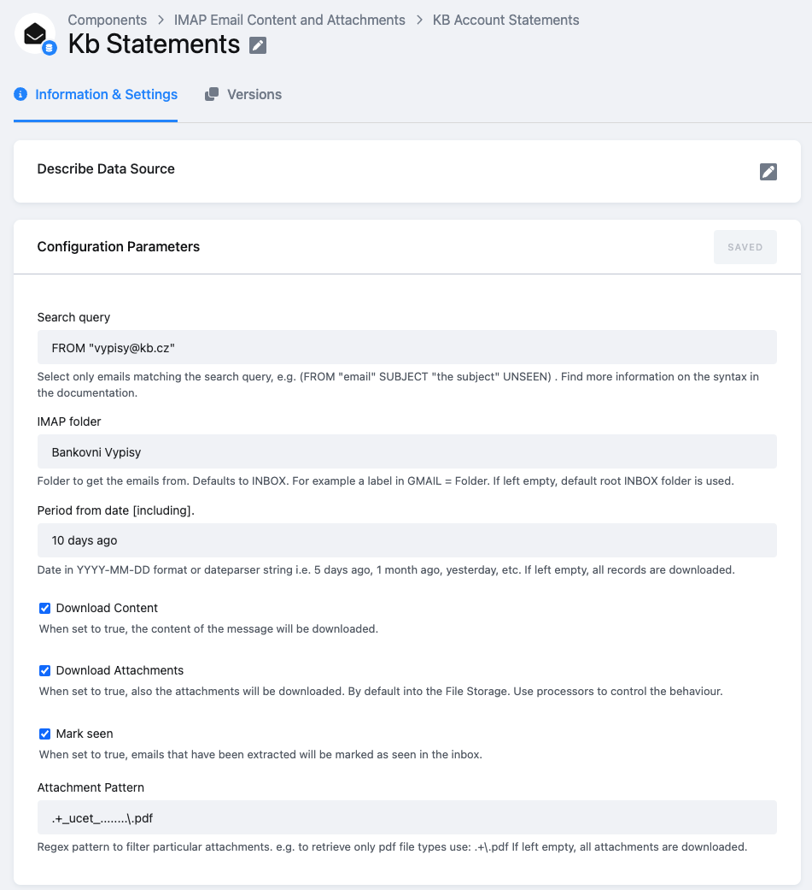

# Komercni Banka PDF Account Statement Parser


Takes all `.pdf` files in `in/files/` and converts the Komercni Banka Statements (in Czech language) to CSV files stored in `out/tables/`.

The output tables are stored as `sliced tables` => each file is represented inside folders `out/tables/statments.csv` and
 `out/tables/statements_metadata.csv` as header-less CSVs. The column names are included 
 in the respective manifest files.


**Table of contents:**  
  
[TOC]

## Functional notes

CZE Komercni Banka statements are converted into two files:

- `statements.csv` containing the statement rows
- `statements_metadata.csv` containing details about particular statements

The data is outputted `incrementally`.


## Output Structure

### **statements**

|pk                              |statement_metadata_pk           |row_nr|accounting_date|transaction_date|transaction_description|transaction_identification                    |account_name__card_type |account_number__merchant|vs      |ks  |ss       |transaction_type|amount   |
|--------------------------------|--------------------------------|------|---------------|----------------|-----------------------|----------------------------------------------|------------------------|------------------------|--------|----|---------|----------------|---------|
|8a8723bbec95374a367de09dc7d2d5cf|0b13871a680ed5bd7f99ecbe61dcccd3|0     |10.08.2021     |                |PŘÍCHOZÍ               |OI0001SOMEID0 01 001-0012345 1602 12345 12345 |DOE JON                 |43-12345678/0100        |        |    |         |credit          |1666.0   |

### **statements_metadata**

|pk                              |account_number                  |statement_type|iban      |account_type|currency |statement_date                                |statement_number        |account_entity     |start_balance|end_balance|
|--------------------------------|--------------------------------|--------------|----------|------------|---------|----------------------------------------------|------------------------|-------------------|-------------|-----------|
|0b13871a680ed5bd7f99ecbe61dcccd3|123-123123123123/0100           |VÝPIS PERIODICKÝ|CZ123123123123|MůjÚčet Plus|CZK      |07.09.2021                                    |9                       |DN12334_2421-12345-2 ID: 1020947192  DOE JOHN Somewhere 123 / 56 170 00  PRAHA|1000.0       |2666.0     |


## Configuration


### Sample configuration

```json
{
    "definition": {
        "component": "kds-team.processor-kb-account-statement-parser"
    }
}
```
 
# Example Use Case

Most commonly the processor is useful in combination with the [IMAP Email Content Extractor](https://help.keboola.com/components/extractors/communication/email-imap/)



Just include following processor configuration:

```json
{
  "before": [],
  "after": [
    {
      "definition": {
        "component": "kds-team.processor-kb-account-statement-parser"
      }
    }
  ]
}
```
# Development
 
This example contains runnable container with simple unittest. For local testing it is useful to include `data` folder in the root
and use docker-compose commands to run the container or execute tests. 

If required, change local data folder (the `CUSTOM_FOLDER` placeholder) path to your custom path:
```yaml
    volumes:
      - ./:/code
      - ./CUSTOM_FOLDER:/data
```

Clone this repository, init the workspace and run the component with following command:

```
git clone https://bitbucket.org:kds_consulting_team/kds-team.processor-deduplicate-headers.git my-new-component
cd my-new-component
docker-compose build
docker-compose run --rm dev
```

Run the test suite and lint check using this command:

```
docker-compose run --rm test
```

# Testing

The preset pipeline scripts contain sections allowing pushing testing image into the ECR repository and automatic 
testing in a dedicated project. These sections are by default commented out. 

# Integration

For information about deployment and integration with KBC, please refer to the [deployment section of developers documentation](https://developers.keboola.com/extend/component/deployment/) 

Development
-----------

If required, change local data folder (the `CUSTOM_FOLDER` placeholder) path to
your custom path in the `docker-compose.yml` file:

~~~~~~~~~~~~~~~~~~~~~~~~~~~~~~~~~~~~~~~~~~~~~~~~~~~~~~~~~~~~~~~~~~~~~~~~~~~~~~~~
    volumes:
      - ./:/code
      - ./CUSTOM_FOLDER:/data
~~~~~~~~~~~~~~~~~~~~~~~~~~~~~~~~~~~~~~~~~~~~~~~~~~~~~~~~~~~~~~~~~~~~~~~~~~~~~~~~

Clone this repository, init the workspace and run the component with following
command:

~~~~~~~~~~~~~~~~~~~~~~~~~~~~~~~~~~~~~~~~~~~~~~~~~~~~~~~~~~~~~~~~~~~~~~~~~~~~~~~~
git clone git@bitbucket.org:kds_consulting_team/kds-team.processsor-kb-account-statement-parser.git kds-team.processsor-kb-account-statement-parser
cd kds-team.processsor-kb-account-statement-parser
docker-compose build
docker-compose run --rm dev
~~~~~~~~~~~~~~~~~~~~~~~~~~~~~~~~~~~~~~~~~~~~~~~~~~~~~~~~~~~~~~~~~~~~~~~~~~~~~~~~

Run the test suite and lint check using this command:

~~~~~~~~~~~~~~~~~~~~~~~~~~~~~~~~~~~~~~~~~~~~~~~~~~~~~~~~~~~~~~~~~~~~~~~~~~~~~~~~
docker-compose run --rm test
~~~~~~~~~~~~~~~~~~~~~~~~~~~~~~~~~~~~~~~~~~~~~~~~~~~~~~~~~~~~~~~~~~~~~~~~~~~~~~~~

Integration
===========

For information about deployment and integration with KBC, please refer to the
[deployment section of developers
documentation](https://developers.keboola.com/extend/component/deployment/)
